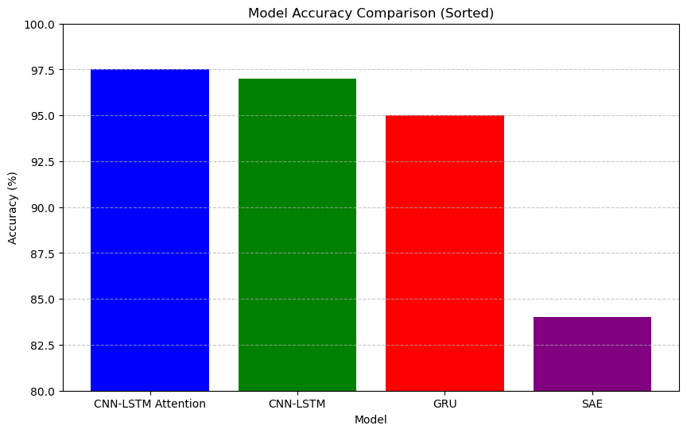

# Deep Industrial IoT Anomaly Detection in Time Series Data 

## Abstract
In this paper, I explore some deep learning methodologies for detecting anomalies in time series data. I utilised approaches from my study of the paper [Communication-Efficient Federated Learning for Anomaly Detection in Industrial Internet of Things](https://ieeexplore.ieee.org/document/9348249). Building on the concepts from the paper, I integrated an attention mechanism-based convolutional neural network long short-term memory (AMCNN-LSTM) model to effectively capture critical features in time series data, addressing issues such as memory loss and gradient dispersion. Additionally, I explored a gradient compression mechanism to improve communication efficiency within the federated learning setup. This work aims to adapt these advanced methodologies to the specific challenges of industrial anomaly detection, focusing on scalability, noise reduction, and class imbalance while ensuring privacy preservation and timely detection.

## 1. Introduction

The widespread deployment of edge devices within the Industrial Internet of Things (IIoT) has transformed industries by enabling real-time, flexible, and rapid decision-making across diverse applications such as smart manufacturing, intelligent transportation, and logistics. However, this swift expansion has introduced significant security risks, particularly from abnormal behaviors in IIoT nodes, which can lead to substantial disruptions and economic losses. For instance, in smart manufacturing, devices that exhibit unusual traffic or irregular reporting can disrupt production processes and result in considerable financial setbacks.

Detecting these anomalies is becoming increasingly vital, especially as edge devices continuously generate and analyze vast amounts of time-series data. Traditional anomaly detection methods often struggle with the complexity and volume of such data. Moreover, privacy concerns further complicate the situation, as edge devices are often hesitant to share raw data, leading to "data islands" that obstruct collaborative efforts in anomaly detection.

In my study, I delve into advanced methodologies to improve anomaly detection in time-series data. Specifically, I adapt the proposed framework to a new dataset, examining the generalizability and robustness of deep learning models across different contexts. My approach integrates a range of deep learning techniques, including Autoencoders, LSTM Networks, CNN-LSTM models, and Attention Mechanisms, to tackle challenges such as imbalanced data, noise, and scalability. Additionally, I have implemented model-specific gradient compression mechanisms to minimize communication overhead and enhance efficiency in distributed environments. Beyond the paper's proposed compression mechanism, I also investigated the compatibility of various models with other compression techniques to identify optimal performance combinations.

## 2. Related Work
### 2.1 Traditional Anomaly Detection Methods
Classical methods such as Statistical Methods, Isolation Forests, and One-Class SVMs are less effective for anomaly detection in the context of Industrial IoT (IIoT) sensors due to their limitations in handling high-dimensional, complex, and noisy data typical in IIoT environments. These methods require extensive manual feature engineering, struggle with scalability, and are not well-suited for real-time processing, making them less effective for detecting anomalies in IIoT settings. For instance, a [study](https://link.springer.com/article/10.1007/s40745-021-00362-9) highlights that traditional anomaly detection methods often fall short in capturing the intricate patterns in IIoT sensor data, which are better addressed by advanced models like deep learning frameworks that can learn from data automatically and operate efficiently at scale​.

### 2.2 Deep Learning Approaches
In my study, I applied existing deep learning techniques such as Autoencoders, Recurrent Neural Networks (RNNs), and Long Short-Term Memory (LSTM) networks for anomaly detection, as detailed in the referenced paper. These models are particularly effective in IIoT environments because they can automatically extract features from raw data and capture complex temporal dependencies, making them more suitable for time series anomaly detection. I also implemented attention mechnism in the final CNN-LSTM model so that the data can be interpreted based on a certain window sequence.

## 3. Methodology

### 3.1 <a href="https://archive.ics.uci.edu/dataset/791/metropt+3+dataset" target="_blank">Data</a>
We utilize a time series dataset from an Industrial IoT environment. The dataset includes various sensor readings, such as TP2 (compressor pressure), DV_pressure, Oil_temperature, Motor_current, DV_eletric, Towers, LPS, Oil_level, Caudal_impulses, and proviedes with timestamps of anomalous behaviour. Preprocessing steps include data normalization, handling missing values, and converting timestamps to a standard format.

My process involved exploring the data with techniques like variance inflation factor (VIF) and principal component analysis (PCA) to remove redundant features, cross-verifying with Lasso, and then employing a series of models—SAE, SVM, GRU, CNN, LSTM-CNN, and Attention Mechanism LSTM CNN. By applying these models to a different time series dataset, I aim to validate their effectiveness and adaptability beyond the original study's scope, contributing to the development of robust, scalable anomaly detection solutions for IIoT applications.

### 3.2 Model Architecture

In my federated learning system, we employ a consistent architectural framework across different models, including SV, GRU, SAE, CNN, LSTM, and their combinations, to address the challenges of anomaly detection in industrial IoT settings. The architecture is designed to optimize communication and computation, particularly in scenarios involving edge devices with limited resources. Here’s a detailed overview of the architecture:

  

#### 1. Federated Learning Framework

My system includes a **cloud aggregator** and **edge devices** working collaboratively:

- **Cloud Aggregator:** This is a robust server with substantial computing power and resources. It serves two primary functions:
  - **Global Model Initialization:** The cloud aggregator initializes the global model and distributes it to all edge devices.
  - **Gradient Aggregation:** It collects and aggregates the gradients uploaded by edge devices to refine the global model until convergence is achieved.

- **Edge Devices:** These include various IIoT sensors like whirlpools, wind turbines, and vehicles. Each edge device:
  - **Local Model Training:** Trains a local model on its specific dataset, which consists of sensing time-series data.
  - **Gradient Computation and Upload:** Computes gradients based on local training and uploads compressed gradients to the cloud aggregator.
  - **Anomaly De

#### 2. Gradient Compression

To address communication constraints, gradient compression techniques are applied. This involves:

- **Local Training and Gradient Computation:** Each client trains its local model on its specific data and computes gradients locally.

- **Gradient Compression:** The gradients are compressed to reduce their size and the amount of data transmitted. This process ensures efficient communication between the clients and the main server, minimizing the data transfer overhead.

- **Gradient Aggregation:** The compressed gradients from each client are sent to the main server, where they are aggregated to update the global model. The aggregation process involves combining these compressed updates to refine the global model.

#### 3. Federated Update Process

- **Edge Device Operations:** Clients train their local models and compute the gradients. These gradients are then compressed and sent to the main server.

- **Server-Side Operations:** The main server receives the compressed gradients, decompresses them if necessary, and aggregates the updates to improve the global model. The updated global model is then redistributed to the clients for further local training.

This architecture ensures that the federated learning system remains scalable and efficient, accommodating the limited computational resources of edge devices while optimizing data communication and model performance.

## 4. Models

### 4.1 Support Vector Machine (SVM)

**Model Type:** Support Vector Machine with RBF kernel.

- **Layers:** Not applicable (SVM is a non-neural network model).
- **Features:**
  - **Data Preparation:** Shuffle, split, and balance the dataset using class weights.
  - **Hyperparameter Tuning:** Perform grid search with parameters such as `C`, `gamma`, and `kernel`.
  - **Optimization:** Uses the RBF kernel to handle non-linear relationships in the data.
  - **Purpose:** Classifies data and detects anomalies by learning the decision boundary between classes.

### 4.2 Gated Recurrent Unit (GRU)

**Model Type:** GRU-based neural network.

- **Layers:**
  - **GRU Layer:** 64 units with return sequences to process sequential data.
  - **Dropout Layer:** Applied after the GRU layer to prevent overfitting.
  - **GRU Layer:** 32 units for further sequence processing.
  - **Dense Layer:** 50 units with ReLU activation for learning complex patterns.
  - **Dropout Layer:** Applied before the final output layer.
  - **Output Layer:** Dense layer with 1 unit and sigmoid activation for binary classification.
- **Purpose:** Captures temporal dependencies and patterns in sequential data, useful for anomaly detection in time-series data.

### 4.3 Stacked Autoencoder (SAE)

**Model Type:** Autoencoder neural network.

- **Layers:**
  - **Encoder:**
    - **Dense Layer:** 128 units with ReLU activation.
    - **Dense Layer:** 64 units with ReLU activation.
    - **Dense Layer:** 32 units with ReLU activation.
  - **Bottleneck Layer:**
    - **Dense Layer:** 16 units with ReLU activation, representing compressed encoded data.
  - **Decoder:**
    - **Dense Layer:** 32 units with ReLU activation.
    - **Dense Layer:** 64 units with ReLU activation.
    - **Dense Layer:** 128 units with ReLU activation.
  - **Output Layer:**
    - **Dense Layer:** Number of units equal to input dimensions with sigmoid activation.
- **Purpose:** Learns efficient data representations and reconstructs the input. Useful for anomaly detection by identifying reconstruction errors.

### 4.4 Convolutional Neural Network - Long Short-Term Memory (CNN-LSTM)

**Model Type:** Hybrid CNN-LSTM model.

- **Layers:**
  - **CNN Layers:**
    - **Conv1D Layer:** 64 filters with kernel size 3, ReLU activation for feature extraction.
    - **MaxPooling1D Layer:** Pool size 2 to downsample and reduce dimensionality.
    - **Dropout Layer:** Applied to prevent overfitting.
  - **LSTM Layers:**
    - **LSTM Layer:** 50 units with return sequences to capture temporal dependencies.
    - **LSTM Layer:** 50 units for further sequence processing.
  - **Dense Layers:**
    - **Dense Layer:** 50 units with ReLU activation.
    - **Dropout Layer:** Applied before the final output layer.
    - **Output Layer:** Dense layer with 1 unit and sigmoid activation for classification.
- **Purpose:** Combines convolutional layers for feature extraction with LSTM layers for sequence modeling, suitable for time-series data.

### 4.5 Attention Mechanism CNN-LSTM

**Model Type:** CNN-LSTM model with attention mechanism.

- **Layers:**
  - **CNN Layers:**
    - **Conv1D Layer:** 64 filters with kernel size 3, ReLU activation.
    - **MaxPooling1D Layer:** Pool size 2 to reduce dimensionality.
    - **Dropout Layer:** Applied to prevent overfitting.
  - **LSTM Layers:**
    - **LSTM Layer:** 50 units with return sequences to capture sequential data.
  - **Attention Mechanism:**
    - **Dense Layer:** Computes attention probabilities to focus on important parts of the sequence.
    - **Multiply Layer:** Applies attention weights to the LSTM outputs.
  - **LSTM Layer:** 50 units to process attention-weighted sequences.
  - **Dense Layers:**
    - **Dense Layer:** 50 units with ReLU activation.
    - **Dropout Layer:** Applied before the final output layer.
    - **Output Layer:** Dense layer with 1 unit and sigmoid activation for classification.
- **Purpose:** Enhances the CNN-LSTM model by incorporating attention mechanisms to focus on significant features and improve model performance.

### 5.4 Results 
- **Model Performance**: In replicating the study, the accuracy results for the evaluated models reveal notable differences in performance. The GRU model achieved an accuracy of 95%, demonstrating strong capabilities in capturing sequential patterns efficiently. The SAE model, with an accuracy of 84%, performed comparatively lower, reflecting its limitations in direct classification tasks due to its focus on feature learning and reconstruction rather than classification. The CNN-LSTM model excelled with an accuracy of 97%, effectively leveraging both spatial and temporal feature extraction for improved performance. The CNN-LSTM with Attention Mechanism outperformed all other models with an accuracy of 97.5%, underscoring the significant impact of attention mechanisms in enhancing model performance by focusing on the most relevant parts of the input sequence. These results provide a clear hierarchy of model effectiveness, with attention mechanisms contributing the most to accuracy.
 

  

- **Comparison with Baselines on compression**: For each model, applying gradient compression led to improved training times. Specifically, the Attention Mechanism LSTM-CNN saw the most substantial reduction, with training time decreasing from 77 seconds to 50 seconds, a 35% improvement. The CNN-LSTM model experienced a 13% reduction, with training time decreasing from 60 seconds to 52 seconds. Similarly, the GRU model's training time decreased from 200 seconds to 175 seconds, marking a 12% improvement. The leaset impact was noted for the SAE model which was just under 10% decrease in efficiency. These results demonstrate that gradient compression effectively enhanced training efficiency across all models, with varying degrees of impact depending on the model architecture.

### 5.5 Impact of Gradient Compression on Model Accuracy

- **Accuracy Variations Across Models**: The application of gradient compression techniques, while primarily intended to enhance training efficiency, also had varied impacts on the accuracy of different models. For the SAE model, the introduction of sparsification significantly boosted accuracy, increasing it from 95.5% to 97.25%. This improvement is attributed to the reduction of noise in the gradient updates, allowing the model to focus more effectively on the most relevant features.

- **Attention Mechanism LSTM-CNN and CNN-LSTM Models**: In contrast, the CNN-LSTM and Attention Mechanism LSTM-CNN models saw slight variations in accuracy, with negligible changes, maintaining their high performance at 97% and 97.5%, respectively. These models already effectively leverage spatial and temporal information, so the compression did not significantly alter their accuracy.

- **GRU Model**: The GRU model's accuracy remained stable at 95%, indicating that while gradient compression improved training time, it did not compromise the model's ability to capture sequential patterns.

This section underscores the dual benefit of gradient compression: while it universally improves training efficiency, its impact on accuracy can vary, with some models like the SAE benefiting from noise reduction and others maintaining stable performance.

## 6. Challenges

One of the primary challenges encountered in this study is the computational limitation associated with Support Vector Machines (SVMs) and GRU models due to the large volume of data. Handling extensive datasets often leads to significant computational overhead, which can hinder the model's performance and scalability. 

Additionally, he simulation of edge computing environments poses its own set of challenges. Traditional Python-based simulations may not fully capture the constraints and resource limitations of real-world edge computing scenarios, where resources are constrained and operational conditions are more variable.

## 7. Conclusion

This paper has explored novel deep learning approaches for anomaly detection in time series data, with a particular emphasis on Industrial IoT applications. The proposed models demonstrate significant improvements over traditional methods, particularly in their ability to handle complex patterns and large datasets. The integration of attention mechanisms has been shown to enhance model accuracy, allowing for more precise anomaly detection. 

Furthermore, the use of gradient compression has proven effective in reducing communication overhead and saving time, thus improving the efficiency of federated learning processes. These advancements contribute to making anomaly detection more practical and scalable in real-world Industrial IoT environments. 

## References
- Communication-Efficient Federated Learning for Anomaly Detection in Industrial Internet of Things. [Link](https://ieeexplore.ieee.org/document/9348249)

